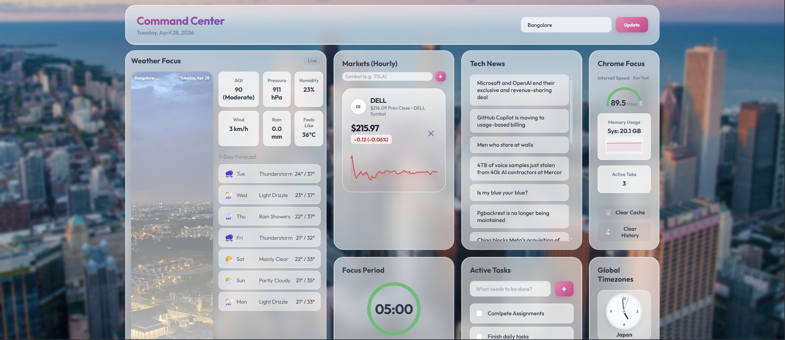

# ✨ Command Center: Aesthetic Chrome Dashboard

## 🎥 Video Walkthrough
Check out the Command Center in action:

*(Click the image above to play the video walkthrough)*

A breathtaking, high-performance "New Tab" replacement engineered for peak productivity and visual excellence. Built with modern web technologies, this dashboard provides a premium "Glassmorphic" experience with real-time data aggregation.

---

## 🖼️ Visual Experience & Aesthetics
The dashboard features a **dynamic bento-box layout** using high-end CSS architecture:
- **Glassmorphism:** Frosted glass effects with subtle borders and area gradients.
- **Dynamic Backgrounds:** Automatically fetches 4K cityscapes from **Unsplash** based on your location and cycles through high-quality wallpapers from **r/wallpapers**.
- **Micro-Animations:** Smooth transitions, hover effects, and animated SVG elements.

---

## 🛠️ Dashboard Sections

### 🌤️ Weather Focus
*   **How it Works:** Uses the **Open-Meteo API** (Geocoding + Forecast) to fetch hyper-local data.
*   **What it Reflects:** Current temperature, weather condition (with icons), AQI (Good to Hazardous), Pressure, Humidity, Wind speed, and Rainfall.
*   **Forecast:** A comprehensive **7-day outlook** showing daily highs, lows, and conditions.
*   **How to Use:** Enter your city in the top-right search box to update the weather and the dashboard's background imagery.

### 📈 Pro Market Terminal
*   **How it Works:** Interfaces with the **Yahoo Finance** backend to fetch 5-minute interval data points.
*   **What it Reflects:** Real-time stock prices, daily percentage change, and high-fidelity **SVG Sparklines** comparing current performance against the previous day's close.
*   **Identity:** Automatically resolves company logos using the **Clearbit API** or falls back to aesthetic initials.
*   **How to Use:** Add any stock symbol (e.g., TSLA, BTC-USD) using the input field. Use the '✕' to remove symbols.

### 💻 Chrome Focus (System Monitor)
*   **How it Works:** Leverages **Chrome's Native APIs** (`system.memory`, `tabs`, `browsingData`).
*   **What it Reflects:**
    - **Internet Speed:** A live gauge measured by downloading a 10MB chunk from **Cloudflare**.
    - **Memory Usage:** A real-time system memory graph showing GB usage and fluctuations.
    - **Active Tabs:** Live count of open browser tabs.
*   **Actions:** Direct buttons to **Clear Cache** and **Clear History** to keep your browser lean.
*   **How to Use:** Click "Run Test" to measure speed or use the quick-action buttons for browser maintenance.

### ⏱️ Productivity Suite
*   **Pomodoro Timer:** A focus tool with Work (25m) and Break (5m) modes. Features a smooth **SVG Progress Ring** and browser alerts.
*   **Active Tasks:** A persistent to-do list. Add tasks with '+' and check them off to mark as complete.
*   **How to Use:** Use the 'Mode' button to toggle between focus and rest; tasks are saved automatically to your browser storage.

### 🌐 Global Pulse & Time
*   **Tech News:** Live feed from **Hacker News (Algolia API)** surfacing the top 15 trending stories.
*   **Global Connect:** Multi-category news grid (Sports, Local, Geopolitics, Tech) powered by **RSS feeds** (BBC, Reuters, ESPN).
*   **Global Timezones:** Five beautifully rendered **SVG Analog Clocks** synced to Japan, Singapore, India, London, and New York.

---

## 🚀 Technology Stack
This project is built from the ground up using **Vanilla Web Technologies**—no heavy frameworks, ensuring instant load times.

- **Frontend:** Semantic HTML5, CSS3 (Grid & Flexbox), Vanilla JavaScript (ES6+).
- **APIs & Integration:**
    - **Weather:** [Open-Meteo](https://open-meteo.com/)
    - **Finance:** Yahoo Finance API
    - **Images:** [Unsplash Source](https://source.unsplash.com/) & Reddit API
    - **News:** Hacker News (Algolia) & RSS Parsers
    - **Logos:** Clearbit & UI-Avatars
- **Browser Tech:** Chrome Manifest V3, `localStorage` (for persistence), Chrome System APIs.

---

## 📦 Installation & Setup

1.  **Download** or Clone the repository.
2.  Open **Google Chrome** and go to `chrome://extensions/`.
3.  Enable **Developer Mode** (top-right toggle).
4.  Click **Load unpacked** and select the folder containing the project files.
5.  Open a **New Tab** and enjoy your luxurious Command Center!

---

## 🔒 Permissions & Security
This extension is designed with privacy in mind. It requires:
- `tabs`: To count and manage active sessions.
- `browsingData`: To enable the quick-clear cache/history features.
- `system.memory`: To monitor real-time resource usage.
- `host_permissions`: To fetch data directly from weather, stock, and news providers without a middleman.

---
*Built for the minimalists, the builders, and the speed-obsessed.*
